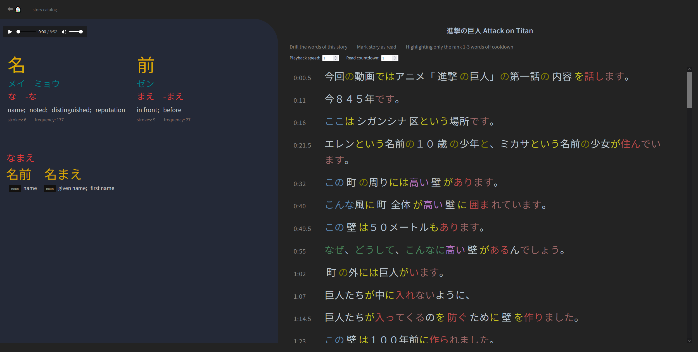
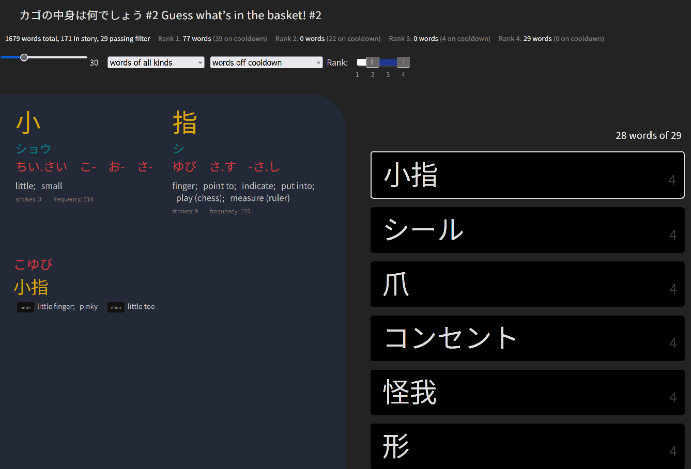

# Japanese Input trainer

A program for [learning Japanese through input](input.md) by listening to stories and drilling their vocabulary.

## Running the program

For Windows, you can just clone the repo and run `app/japanese.exe`, then go to `localhost:8080` in a web browser.

For other platforms, you'll need to build the executable first:

1. [Install Go](https://go.dev/doc/install), version 1.15 or later.
1. At the command line, switch to the `app` directory.
1. If on Linux, you may need to run `sudo apt install build-essential` (or equivalent for your distribution)
1. Run `go get` to fetch the package dependencies.
1. Run `go build` to build the executable.

## Importing stories

Stories are imported in sets called "sources", which are represented as directories with files in a certain format. To import a source:

1. Copy or move the source directory to `/static/sources/`
2. At the command line, run `./japanese.exe import` to (re)import all sources. (Sources that haven't changed since last import will not be updated by reimporting.)

## Main page

The main page displays the schedule of story repetitions, followed by the catalog of imported stories.

In the catalog, the "schedule" link on a story adds 5 listening reps and 4 drilling reps to the schedule, spread out over about 2 weeks.

In the schedule, you can remove reps and move them up or down in the schedule:

- Moving a rep up or down will also move all reps after it of the same story.
- As a rule, two reps of the same story cannot be scheduled for the same day.

## Story page

A story's page displays its title and text. 

A link under the title takes you to a page for drilling the words and kanji in the story.

The "log this story" link will remove the rep from the schedule.

### Video and audio player hotkey controls

- `f` : toggle fullscreen
- `s` : toggle play/pause
- `d` : jump ahead ~1 seconds
- `a` : jump back ~1 seconds
- `e` : jump ahead ~5 seconds
- `q` : jump back ~5 seconds
- `-` : decrease playback speed
- `+` : increase playback speed

Because subtitle data from sources may not line up with the video or audio, these keys may be helpful:

- `alt` + `-` : decrease the start and end time of the current subtitle (and all after it) by 0.25 seconds
- `alt` + `+` : increase the start and end time of the current subtitle (and all after it) by 0.25 seconds

To help break up longer stories into shorter ones:

- `[` : set start time marker to the player's current time
- `]` : set end time marker to the player's current time

Once you've set start and end markers, you can create a new story by clicking the "create story from subrange" link in the sidebar.

## Drill page

The words of the drill are displayed in a random-ordered list, with the current word at the top.

Hotkeys that affect the current word:

- `d`: mark the word correct
- `a`: mark the word incorrect
- `1` : toggle whether the word is archived

Once you mark all words in the list correct or incorrect, the words you marked incorrect will be reshuffled for another round of drilling.

Words in the drill list can also be filtered by type: kanji characters, words spelt in katakana, ichidan verbs, or godan verbs.

The "log this drill" link will log the drill, removing it from your schedule and incrementing the repetition count for the words you drilled.