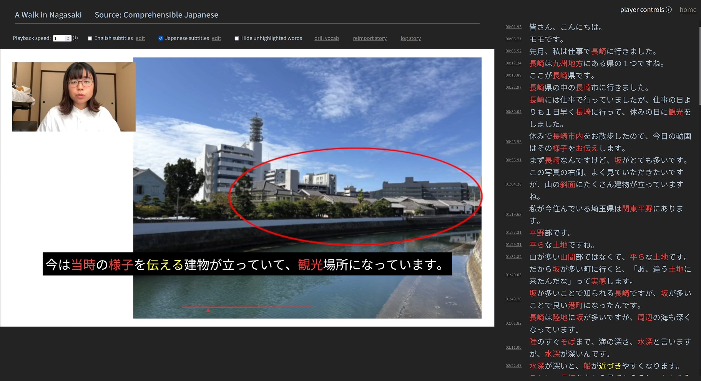

# Japanese Input trainer

A program for [learning Japanese through input](input.md) by listening to stories and drilling their vocabulary.

## Running the program

> WARNING: The repo history is much larger than the releases, so you should just download the latest release unless you actually want to modify the code and submit PR's.

For Windows, you can just download the latest release and run `app/japanese.exe`, then go to `localhost:8080` in a web browser.

For other platforms, you'll need to build the executable first:

1. [Install Go](https://go.dev/doc/install), version 1.15 or later.
1. At the command line, switch to the `app` directory.
1. If on Linux, you may need to run `sudo apt install build-essential` (or equivalent for your distribution)
1. Run `go get` to fetch the package dependencies.
1. Run `go build` to build the executable.

## Importing stories

Stories are imported in sets called "sources", which are represented as directories directly under the "sources" directory. For example, the directory "sources/example" represents a source named "example".

In a source directory, each mp3 and mp4 file represents an individual story. For a story named `thing.mp3` or `thing.mp4`, the English and Japanese VTT subtitle files in the same directory should be named, respectively, `thing.en.vtt` and `thing.ja.vtt`.

The import page (linked in the sidebar on main page) lists all detected source directories. Clicking the `import` button of a source imports or re-imports all the stories in that source. (Re-importing a story reprocesses its subtitle files.)

## Words

The words of all imported stories are stored in the database by their "base form", e.g. all variations of a verb are stored in their so-called "dictionary form".

Words can be 'archived':

- archived words are filtered out by default in drills
- unarchived words are highlighted in subtitles and the sidebar transcript (with unarchived verbs given a distinct color)

You can toggle a word's archived status by double clicking it in a subtitle or in the sidebar transcript.

> TIP: Rather than wait to archive words once you've mastered them, you should archive words when they are just reasonably familiar. When looking up a word, if you think 'Oh yeah, I knew that!', it's probably time to archive the word. Or another way to think of it: if you can remember that you've seen a word and its definition several times or more, you already have the foundation for acquiring the word, even if you don't yet "know" it.

## Player hotkey controls

- `f` : toggle fullscreen
- `s` : toggle play/pause
- `d` : jump ahead less than a second
- `a` : jump back less than a second
- `e` : jump ahead a few seconds
- `q` : jump back a few seconds
- `c` : jump ahead to the next subtitle
- `z` : jump back to the previous subtitle
- `x` : jump to start of the current subtitle
- `g` : open the current subtitle in Google Translate
- `-` : decrease playback speed
- `+` : increase playback speed

## Subtitle timing adjustments

In the story page's right sidebar, you'll see the subtitles presented in a list. Buttons at the top of the sidebar allow you to adjust the timings of the subtitles. You can also in the sidebar:

- split a subtitle into two by ctrl-clicking the word which you want to be the start of the new second subtitle.
- merge a subtitle with the previous by ctrl-clicking its timestamp

## Vocab drills

On the drill page, the words are displayed in a random order, with the current word at the top.

Hotkeys that affect the current word:

- `d`: mark the word correct
- `a`: mark the word incorrect
- `1` : toggle whether the word is archived

Once you mark all words in the list correct or incorrect, the words you marked incorrect will be reshuffled for another round of drilling.

Words in the drill list can be filtered by type: kanji characters, words spelt in katakana, ichidan verbs, or godan verbs.