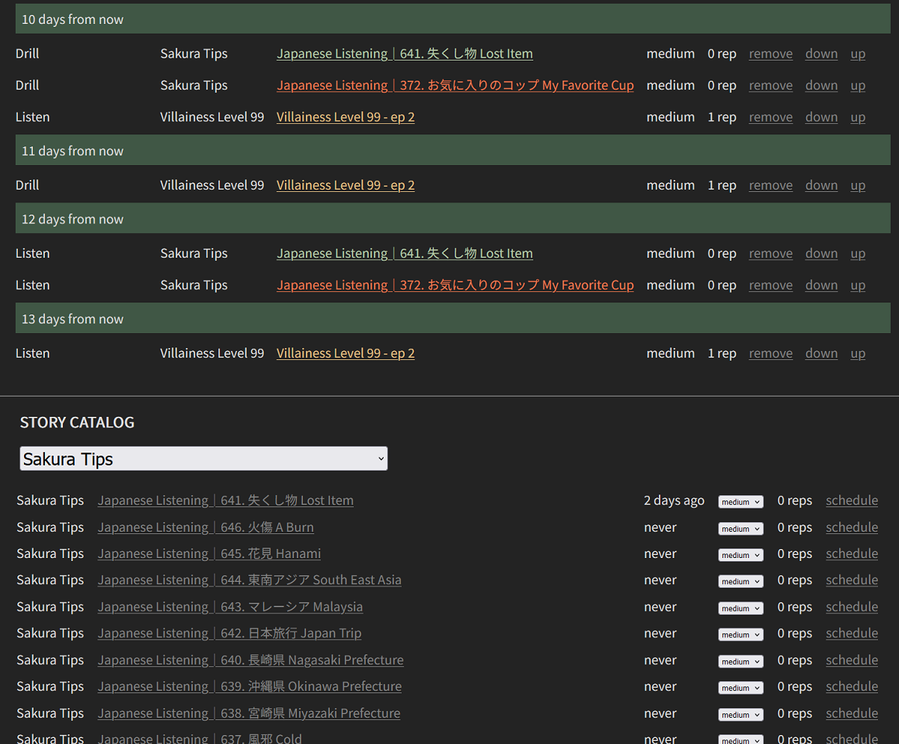

# Japanese Vocab trainer

A program for collecting stories (short excerpts of Japanese) and drilling their vocabulary. An instance of the app will be hosted soon at [JapanVocab.com](https://japanvocab.com).

## Running

1. [Install Go](https://go.dev/doc/install), version 1.15 or later.
1. In the `app` directory, use `go build` to make the executable.
1. Run the executable.
1. In the browser, open `localhost:8080`

## Stories

You can add stories *via* the form on the main page. For example, paste the title of a youtube video, its link, and its Japanese transcript into the form, then click the "Create Story" button.

You can set the status of each story: 

- "Current": for stories you want to focus on
- "Read": for stories you want to put aside but revisit later
- "Never Read": the initial state of new stories
- "Archive": for stories you are unlikely to revisit

Click a story's title to see its text. Through grammatical analysis, the words of the stories are highlighted based on part of speech:

- white words: nouns
- yellow: particles
- dark yellow: connective particles (such as の and と)
- red: verbs
- dark red: verb auxilliaries and the copula
- green: adverbs
- violet: i-adjectives
- blue: pronouns and determines (such as これ and 何)

Note that the grammatical analysis is not always 100% accurate but is generally quite good.

Clicking a word selects it and shows its definitions and information about its kanji. Hotkeys:

- 1: sets the selected word's rank to level 1
- 2: sets the selected word's rank to level 2
- 3: sets the selected word's rank to level 3
- 4: sets the selected word's rank to level 4
- space: marks the selected word as reviewed with the current timestamp

## Drilling

From a story's page, you can click "drill words" to drill its words. Two links at the top of the main page let you drill the words from all stories or the words from all current stories.

In the word list, word rank is displayed on the right. New words start off at Rank 1. Words with higher ranks have longer cooldowns:

- Rank 1 cooldown: 5 hours
- Rank 2 cooldown: 4 days
- Rank 3 cooldown: 30 days
- Rank 4 cooldown: 1000 days

Hotkeys:

- **d** marks the current word correct (moving the card to the discard pile at the bottom) and sets its timestamp
- **a** marks the current word wrong (marking it red and moving it down to the second position in the list) and sets its timestamp
- **1**: sets the selected word's rank to level 1
- **2**: sets the selected word's rank to level 2
- **3**: sets the selected word's rank to level 3
- **4**: sets the selected word's rank to level 4

When you exhaust the list, the words you marked wrong will be reshuffled. Keep answering until all words are marked correct.

When you mark a word correct or wrong, it is put on cooldown.

By deafult, the list includes only words off cooldown, but you can choose to include all words or only words *on* cooldown.

Words can also be filtered by type: kanji characters, words spelt in katakana, ichidan verbs, or godan verbs.