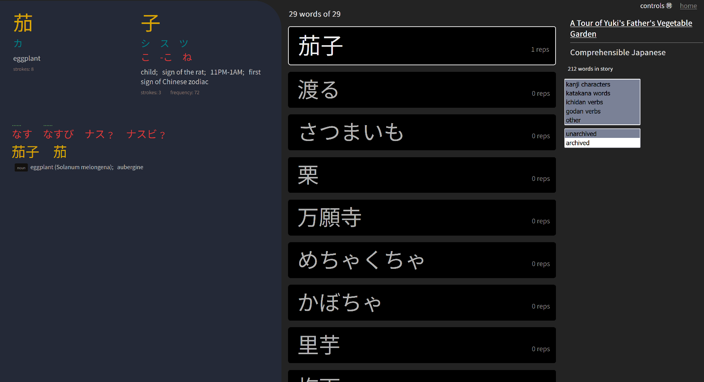

# Japanese Input trainer

A program for [learning Japanese through input](input.md) by listening to stories and drilling their vocabulary.

## Running the program

For Windows, you can just clone the repo and run `app/japanese.exe`, then go to `localhost:8080` in a web browser.

For other platforms, you'll need to build the executable first:

1. [Install Go](https://go.dev/doc/install), version 1.15 or later.
1. At the command line, switch to the `app` directory.
1. If on Linux, you may need to run `sudo apt install build-essential` (or equivalent for your distribution)
1. Run `go get` to fetch the package dependencies.
1. Run `go build` to build the executable.

## Importing stories

Stories are imported in sets called "sources", which are represented as directories with files in a certain format. To import a source:

1. Copy or move the source directory to `/static/sources/`
2. At the command line, run `./japanese.exe import` to (re)import all sources. (Sources that haven't changed since last import will not be updated by reimporting.)

## Main page

The main page displays first the "current stories" (stories with queued repetitions) and then the full story catalog.

In the catalog, select a source from the drop down, and click "queue reps" on a story to effectively add it to the "current stories". (The "queue reps" link adds 5 listening reps alternated with 4 drilling reps. You can edit a story's rep queue on the story's page.)

## Story page

A story's page displays its title, text content, and a player for its audio or video.

The "drill the words of this story" link takes you to a page for drilling the words and kanji of the story.

The "log this story" link will log the rep (record the date of the rep and remove the first listen rep from the queue).

Following the label "Reps todo", you'll see the queued reps:

- Clicking a rep toggles its type (between listening and drilling).
- Alt-clicking a rep inserts another rep of the same kind after it in the queue.
- Ctrl-clicking a rep removes it from the queue.

### Video and audio player hotkey controls

- `f` : toggle fullscreen
- `s` : toggle play/pause
- `d` : jump ahead ~1 seconds
- `a` : jump back ~1 seconds
- `e` : jump ahead ~5 seconds
- `q` : jump back ~5 seconds
- `-` : decrease playback speed
- `+` : increase playback speed

Because subtitle data from sources may not line up with the video or audio, these keys may be helpful:

- `alt` + `-` : shift all subtitle timings forward by 0.2 seconds
- `alt` + `+` : shift all subtitle timings back by 0.2 seconds
- `alt` + `[` : shift the timings of the first subtitle after the current timemark up to the current timemark, and shift all following subtitles forward the same amount (only does something if the current timemark is between subtitles)
- `alt` + `]` : shift the timings of the first subtitle after the current timemark back by 10 seconds, and shift all following subtitles back the same amount (only does something if the current timemark is between subtitles)

To help break up longer stories into shorter ones:

- `[` : set start time marker to the player's current time
- `]` : set end time marker to the player's current time

Once you've set start and end markers, you can click the "create story from subrange" link in the sidebar.

## Drill page

The words of the drill are displayed in a random-ordered list, with the current word at the top.

Hotkeys that affect the current word:

- `d`: mark the word correct
- `a`: mark the word incorrect
- `1` : toggle whether the word is archived

Once you mark all words in the list correct or incorrect, the words you marked incorrect will be reshuffled for another round of drilling.

Words in the drill list can also be filtered by type: kanji characters, words spelt in katakana, ichidan verbs, or godan verbs.

The "log this drill" link will log the drill, removing the first drilling rep from the story's queue and incrementing the repetition count for the words you drilled.