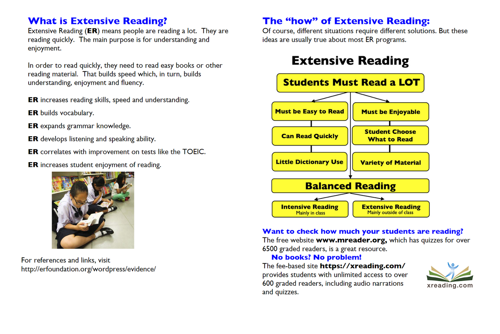

# Learning Japanese through input

## Extensive Input

Wikipedia describes Extensive Reading as:

> …the process of reading longer easier texts for an extended period of time without a breakdown of comprehension, feeling overwhelmed, or the need to take breaks. It stands in contrast to intensive or academic reading, which is focused on a close reading of dense shorter texts, typically not read for pleasure.

> …Students read as much as possible. Reading materials are well within the reader's grammatical and vocabulary competence. The material should be varied in subject matter and character. 

The Extensive Reading Foundation sums it up in a couple slides: 

As a way to learn foreign languages, there’s an obvious problem with Extensive Reading: content that is enjoyable yet also easy to consume for beginners is at best extremely rare if not non-existent. Only until the learner has already acquired a minimum comfort level with a significant chunk of the vocabulary, grammar, and writing system can a learner properly use Extensive Reading as a technique to progress. This is true for all languages but particularly acute for languages with complex writing systems, Japanese first among them.

## Intensive input

As long as the language itself distracts you from focusing on the content of what you read and hear, your content consumption will be *intensive* rather than extensive. This is not a matter of learning style or choice: the beginner simply cannot understand what they read or hear without looking up many words and pondering how the words fit together, a slow process which consumes much mental energy and greatly limits how much language content can be encountered per day.

Still, **intensive reading and listening should be a beginner’s primary learning activity**. If you practice stories intensively as described below for several hours a week, you’ll eventually get reasonably comfortable with native level content. When you reach that point, you can start to incorporate more and more extensive reading into your routine until eventually that can take over as your main activity.

## Selecting stories

The selected language material, which we’ll call “stories”, should meet these criteria:

- All stories should be audio monologues or dialogs by native speakers (not text-to-speech).
- All stories should have accurate transcripts.
- The stories should explicitly be [“comprehensible input”](https://ellevationeducation.com/blog/teaching-comprehensible-input-definition-examples) for beginners. Later when you feel ready, you can graduate to content for native speakers.
- Overly long stories are too onerous to repeat! Early on, the stories can be very short, say 1-2 minutes long. As you progress, the stories can get longer, but 5 minutes is a good average length. As a compromise, you can break longer stories into 5-10 minute chunks.
- While most stories you consume should be at your current level, it’s good also to include some stories one step above your level and some stories one or two steps below. Reaching above your level expands your vocabulary and grammar exposure into new territory, while revisiting lower levels helps develop the fluidity with which you can process content.

## Repeating stories

To get multiple exposures to the vocabulary and grammar encountered, **each story should be repeated at least a few times over the course of a week or two**. (The repetitions should be spread out, so multiple repetitions in a single day count as just one repetition.) 

How many times to repeat a given story is up to your discretion, but I generally find it’s more effective to repeat a story only a few times, then wait several weeks before repeating it a couple times more. Feel free to drop a story at any time because it’s too hard, too easy, too boring, or you just feel like doing something else.

## How to read a story

There are at least five ways to go through a story:

- **Intensive reading**. In this process, you look up every unknown word and puzzle out how all the words fit together, using translation tools and grammatical analysis. This process can be very time consuming: the first read through typically takes me 30 minutes for each 5 minutes of story audio! The good news is that subsequent repetitions will go faster.
- **Listening and reading along with the transcript**. In this process, you should avoid pausing or rewinding the audio. This exercise develops your ability to follow real-time speech, using the transcript as training wheels. It also helps reinforce your reading of kanji words.
- **Listening without the transcript or subtitles**. This is a much truer test of listening comprehension, but I generally only do this with stories comfortably below my current level. Especially in the early stages, listening will require intense concentration, and even after repeating a story several times, you may still fail to identify and understand many words let alone understand the complete sentences. This is normal. It can take several months of practice before you begin to understand most of what you hear, and only through repeated practice will the amount of concentration required gradually diminish.
- **Practice reading and pronunciation by reading the text aloud**. After reading a line, you may want to play the audio to check your pronunciation.
- **Drilling the words and vocabulary**. This gives you more focus time on the individual words and characters. Be aware, though, that once you’ve drilled a word or kanji a dozen times or more, drilling it further has greatly diminishing returns, so you should drop it from your drill set. Drilling helps make words and kanji *familiar* to you, but full acquisition only comes through repeated exposures in a meaningful context.

## Use your own discretion

Keep in mind that **your attention and interest is critical in language acquisition, so you should follow your own impulses**. For any one story, which combination of the above processes you use in what order is up to you.

The first time through a story will generally require a full intensive read through, but how you proceed with that story from there can highly vary. If the material seems easy enough, you might simply listen to the story and only occasionally check the transcript when you can’t make out a word. For more difficult material, you may need to repeat the intensive process a few more times, and even after several repetitions, you may still require the transcript to follow along while listening. As a compromise, you can do a hybrid process: go sentence-by-sentence, listening first with the transcript then playing the sentence again without looking at the transcript.

## Sources of input

These are some of the best sources I've found of comprehensible input material with transcripts:

- [Comprehensible Japanese](https://cijapanese.com/) (transcripts through Patreon)
- [Nihongo Picnic](https://nihongopicnic.notion.site/Nihongo-Picnic-Podcast-s-Transcript-e6c923a2d9f34c1fa278bb5e4531ea0f) (free transcripts)
- [Japanese with Shun](https://www.youtube.com/@JapanesewithShun) (transcripts through Patreon)
- [Sakura Tips](https://sakuratips.com/) (free transcripts)
- [Japanese with Noriko](https://www.japanesewithnoriko.com/) (free transcripts; the podcasts are also posted on youtube)
- [Sakura Podcast](https://sakuratips.com/category/pod-cast/)

These sources lack human-written transcripts in most cases, so you must rely upon Youtube captions or other auto-generated transcription:

- [Bitesize Japanese Podcast](https://www.youtube.com/@the_bitesize_japanese_podcast/videos) 
- [Haru's Japanese Cafe](https://www.youtube.com/@HarusJapaneseCafe)
- [Japanese Language Community](https://www.youtube.com/@erikojuku)
- [Nihongo Con Teppei](https://nihongoconteppei.com/)

